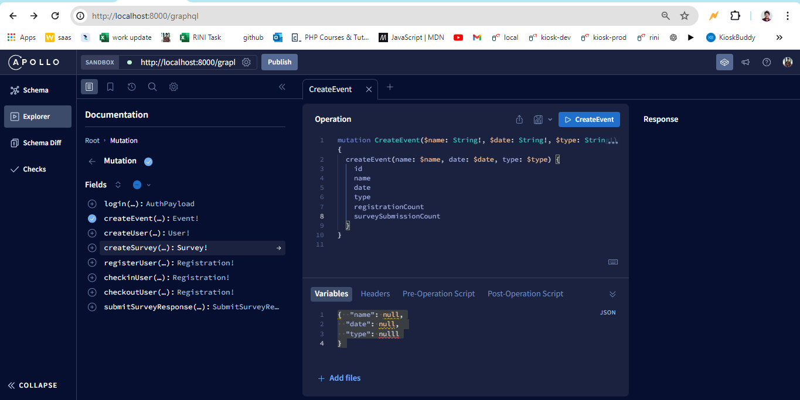

# syscraft-graphql

1. >> git clone https://github.com/rupesh11111/syscraft-graphql.git
   >>
   >
2. >> npm install --force
   >>
   >
3. >> node seed.js
   >> (it creates a admin for you
   >> email -> admin@admin.com
   >> password -> 12345678
   >> )
   >>
   >> docker build -t my-node-app .
   >> docker container run -d -p 3000:3000 -d my-node-app
   >>
   >>
   >
4. >> npm run start
   >> (I have used nodemon for live server)
   >>
   >
5. [http://localhost:8000
   ]()
6. here is the postman collection

   [https://api.postman.com/collections/31174235-ad3f1f97-25d2-4c05-b506-2df525148f9a?access_key=PMAT-01HYQZN38FRHA1QZDPGDWEMPVV]()
7. 
